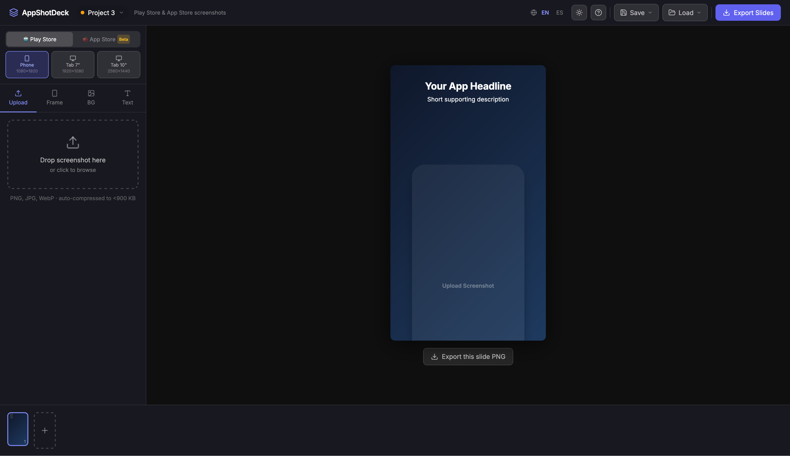
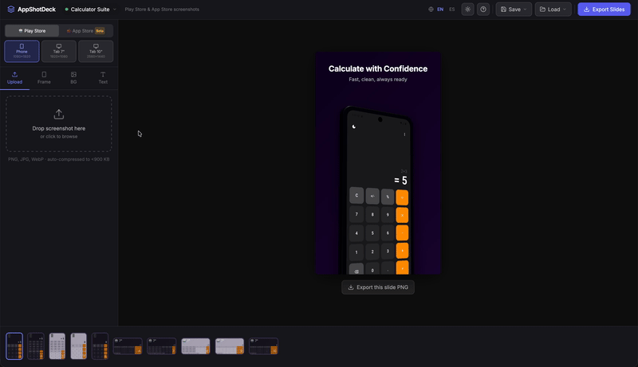
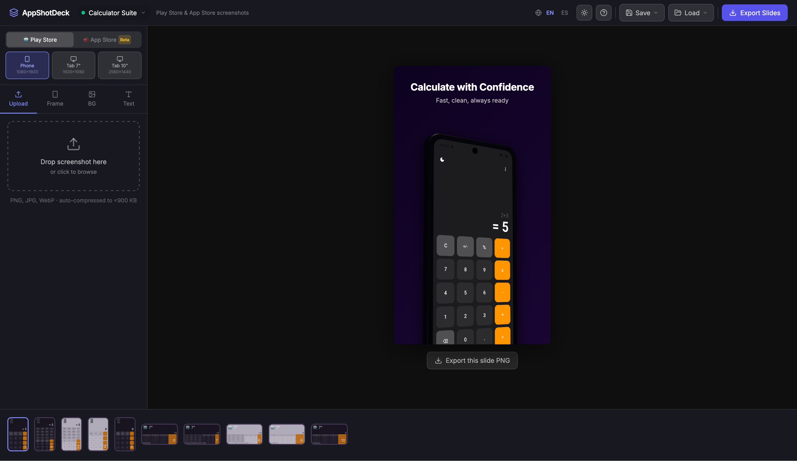
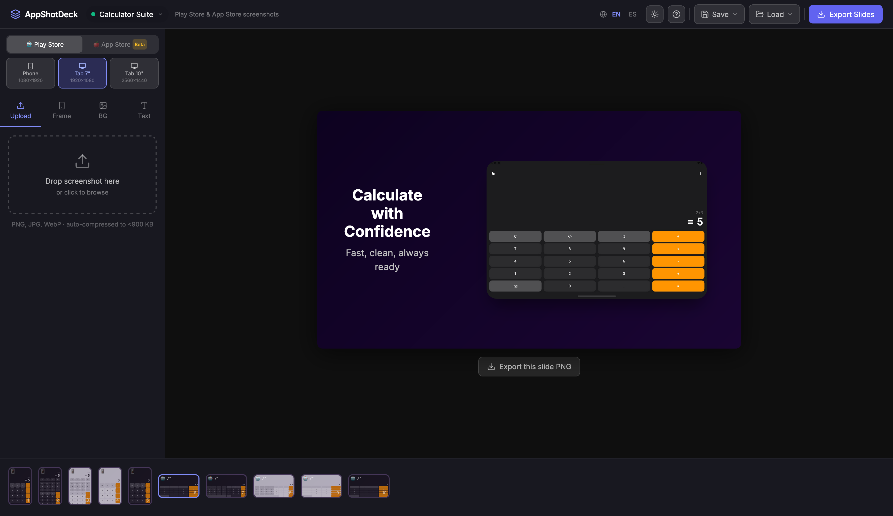
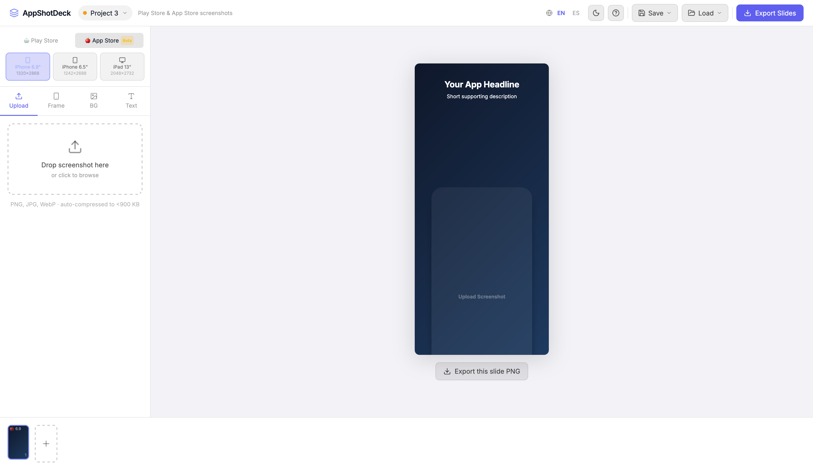

# AppShotDeck



A local, browser-only tool for composing Play Store and App Store marketing screenshots. Upload an app screenshot, wrap it in a device frame, add a headline and subtitle, set a background, and export at store-spec resolution — no server, no cloud, no account required.

## Demo



## Screenshots

| Phone | Tablet |
|---|---|
|  |  |



## Features

- **Multi-format support** — Phone, Tablet 7", Tablet 10", iPhone 6.9", iPhone 6.5", iPad 13"
- **Device frames** — Minimal, Android flat, Android 3D, iPhone flat, iPhone 3D, Android Tab, iPad
- **3D frames** — Real-time WebGL rendering via Three.js with adjustable tilt angle
- **Device controls** — Per-slide position (vertical/horizontal), size scale, and one-click canvas centering
- **Background system** — Dark gradients, light gradients, solid presets, custom color/gradient picker with angle control
- **Text panel** — Headline + subtitle each with independent font family, font weight, font size, color, and show/hide toggle
- **Typography** — 5 bundled fonts (Inter, Poppins, Montserrat, Nunito, Space Grotesk), 4 weights (Light/Regular/SemiBold/Bold), 60–140% size scale
- **Text alignment** — Left / Center / Right, applies to both portrait and landscape layouts
- **Text shadow** — Off / Dark / Light, auto-sizes to canvas resolution
- **Multi-project** — Create, rename, delete, and switch projects; each project has its own slides and screenshots
- **Apply to all slides** — Copy background or text style from active slide to all others in one click
- **Slide strip** — Up to 20 slides per project, drag to reorder, duplicate/remove, per-slide format badge
- **Project save/load** — ZIP export (config.json + images/) and ZIP import per project
- **Workspace save/load** — Save All / Load All exports every project into one workspace ZIP; conflict dialog on import (skip or replace existing)
- **Slide translations** — Add languages to a project (auto-translated via MyMemory or filled manually); preview each language above the canvas; protected words keep brand names untranslated; export per language or all at once
- **Per-language screenshots** — Upload custom screenshots for each language variant (e.g., English app screenshot vs Spanish app screenshot); Replace button below canvas makes it easy to swap screenshots for the active language without switching tabs; drag-and-drop or click on the thumbnail in the Upload tab to replace; "Use default" button reverts to the EN screenshot
- **Export Slides** — Single PNG or all slides as a ZIP; when translations are added, export per language (one ZIP each) or all languages in a single ZIP with per-language folders (`en/…`, `es/…`); each language variant exports its own custom screenshot if available. Files are named per format and zero-padded (`slide-01`, `slide-02`, …) so store uploads stay in order
- **3D export** — WebGL canvas composited onto the DOM capture for pixel-accurate 3D frame exports; zoom callouts are re-composited on top so lenses stay above the 3D device
- **Keyboard shortcuts** — `←/→` navigate slides, `Cmd+D` duplicate, `Delete` remove (with confirmation)
- **Zoom callouts** — Drag a rectangle on the screenshot to create a magnified zoom bubble; drag the bubble anywhere on the canvas to reposition; up to 3 per slide; circle or rect shape; exports with the slide PNG
- **Contextual tooltips** — `ⓘ` hints on non-obvious controls (Pos, Size, Tilt, Apply to all)
- **Help panel** — Slide-in panel with getting started guide, keyboard shortcuts, and pro tips
- **Toast notifications** — Non-blocking error and success feedback (replaces browser alert dialogs)
- **Confirmation dialogs** — Styled modals for slide and project deletion
- **Persistent** — Slide configs in localStorage (Zustand persist), screenshots in IndexedDB
- **Offline-first** — All fonts bundled via @fontsource, no CDN dependencies
- **i18n** — UI fully in English and Spanish (all labels, tooltips, placeholders); slide content translatable to 14 languages via MyMemory
- **Responsive preview** — Canvas scales to fit any window width automatically; header wraps to a second row on narrow viewports so all controls remain accessible

## Tech Stack

| Layer | Library |
|---|---|
| UI | React 19 + TypeScript |
| Styling | Tailwind CSS v3 |
| State | Zustand (with persist middleware) |
| Storage | localStorage (configs) + IndexedDB (screenshots) |
| 3D rendering | Three.js + @react-three/fiber |
| Export | html-to-image + JSZip |
| Translation | MyMemory API (free, no key required) |
| Fonts | @fontsource/inter, poppins, montserrat, nunito, space-grotesk |
| Icons | lucide-react |
| Build | Vite |

## Supported Export Formats

| Store | Format | Resolution |
|---|---|---|
| Play Store | Phone | 1080 × 1920 |
| Play Store | Tablet 7" | 1920 × 1080 |
| Play Store | Tablet 10" | 2560 × 1440 |
| App Store | iPhone 6.9" | 1320 × 2868 |
| App Store | iPhone 6.5" | 1242 × 2688 |
| App Store | iPad 13" | 2048 × 2732 |

## Getting Started

```bash
npm install
npm run dev
```

Open [http://localhost:5173](http://localhost:5173).

## Project Structure

```
src/
  components/
    Canvas/         # SlideCanvas, Device3D (WebGL), ScreenContent
    Sidebar/        # FramePanel, BackgroundPanel, TextPanel, UploadPanel
    SlideStrip.tsx  # Slide thumbnails strip (drag to reorder)
    Header.tsx      # Project switcher, export, save/load
    ConfirmDialog.tsx  # Reusable confirmation modal
  data/
    frames.ts       # Frame definitions (flat + 3D specs)
    backgrounds.ts  # Preset backgrounds (dark, light, solid)
  store/
    useEditorStore.ts  # Main editor state (Zustand + persist)
  utils/
    export.ts       # PNG / ZIP export with WebGL compositing
    project.ts      # Project save/load (ZIP format)
    db.ts           # IndexedDB wrapper for screenshot storage
  locales/          # i18n strings (en, es)
```

## Architecture Notes

**Frame rendering** — Flat frames use nested CSS divs. 3D frames use a WebGL canvas via `Device3D.tsx` with Three.js `ExtrudeGeometry` for the body and `ShapeGeometry` for the screen.

**Device positioning** — Each slide has `deviceOffset` (0 = canvas center, ±30% range) and `deviceScale` (60–100%). Portrait formats shift vertically; landscape tablets shift horizontally.

**Canvas scaling** — Slide canvases always render at full export resolution. A CSS `transform: scale()` shrinks them for the preview.

**3D export** — WebGL content is captured via `canvas.toDataURL()` before `html-to-image` runs, then composited onto the DOM PNG at the correct pixel position.

**Screenshot storage** — Screenshots are kept in IndexedDB keyed by `${projectId}/${slideId}` for EN (default) or `${projectId}/${slideId}/${language}` for language variants. The Zustand store strips `screenshotDataUrl` before persisting to localStorage. On rehydration, screenshots are fetched from IndexedDB asynchronously. Language variants fall back to the EN screenshot if not available. Loading a ZIP project saves all screenshots to IndexedDB immediately.

**Save / load compatibility** — Project ZIPs (v2+) include `languages` and `protectedWords` alongside slide configs and screenshots. Old v1 ZIPs load correctly with empty defaults. All new fields use `?? default` guards so older ZIPs never break.

**Per-language screenshots** — Each language can have its own custom screenshot (e.g., different app UI for different app store localizations). The Replace button below the canvas updates whichever language variant is currently active, making it fast to swap screenshots without visiting the upload panel.

**Project format** — Screenshots stored as real PNG files inside the ZIP (not base64 in JSON). Language variant screenshots are included in export ZIPs alongside default screenshots.

**Text shadow** — Shadow blur scales with canvas width (`W * 0.025`). Color is chosen based on background luminance: dark background → white glow, light background → dark shadow.

## Contributing

Contributions are welcome! If you have an idea for a new frame style, background preset, export format, or any other improvement, feel free to open a pull request.

1. Fork the repo and create a branch from `main`
2. Make your changes (`npm run dev` to test locally)
3. Run `npm run lint` and make sure there are no errors
4. Open a PR with a clear description of what you changed and why

For larger features, opening an issue first to discuss the approach is appreciated.

## License

MIT
